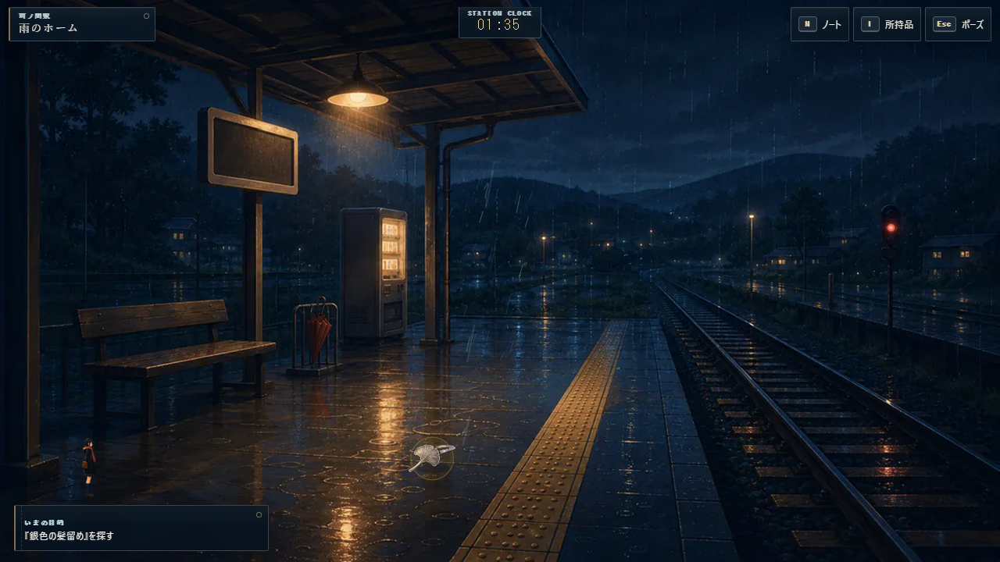

# 雨宿り駅の忘れもの

名前を忘れた主人公ナギが、終電の来ない無人駅で6つの忘れものを持ち主へ返していく、見下ろし型の2D探索アドベンチャーです。5つのエリアを歩き、手がかりをノートで照合し、よみがえる記憶をたどって3種類の結末へ進みます。Phaser 3、TypeScript、Viteで実装した、ブラウザだけで遊べる静的サイトです。

**[公開版をブラウザでプレイ](https://himiko119.github.io/rain-shelter-station/)**





## ゲームの特徴

- 待合室、改札広間、駅員室、跨線橋、雨のホームからなる5エリア
- 6つの忘れもの、12の手がかり、持ち主ごとの会話と記憶演出
- 間違った相手へ返してもアイテムを失わず、停滞や誤返却に応じて3段階のヒントを解放
- A「終電」、B「始発」、C「雨宿り」の3エンディングと閲覧記録
- 自動セーブ、音量・ミュート・文字速度・一括表示・演出軽減設定
- キーボード、マウス／ポインター、390px級のタッチ画面に対応

## 操作

| 操作 | キーボード | ポインター／タッチ |
| --- | --- | --- |
| 移動 | `WASD` / 矢印キー | 行き先をクリック / 方向パッド |
| 調べる・決定・会話送り | `E` / `Enter` / `Space` | 光る対象をクリック / 「調べる」ボタン |
| キャンセル・ポーズ | `Esc` | 「Ⅱ」ボタンまたは画面内の閉じるボタン |
| ノート | `N` | 「N」ボタン |
| 所持品 | `I`（`B`でも開けます） | 「持」ボタン |
| 早足 | 左右の `Shift` を押しながら移動 | 方向パッドでは通常速度 |

対象をクリックした時に距離がある場合、ナギは対象のそばまで自動で歩きます。近くでもう一度クリックすると調べます。

## 必要環境

- Node.js 20.19以上、または22.12以上（Node.js 24でも確認可能）
- npm
- Chrome / Chromium。E2E用ChromiumはPlaywrightから導入できます

```powershell
npm install
npx playwright install chromium
```

## 開発と実行

開発サーバーを起動します。

```powershell
npm run dev
```

本番ビルドを作成し、ローカルで確認します。

```powershell
npm run build
npm run preview
```

## テストと検証

```powershell
npm run lint
npm run typecheck
npm run test
npm run test:watch
npm run test:e2e
npm run build
npm run verify:prod
npm run check
```

`npm run check` はlint、型検査、単体テスト、本番ビルド、本番bundleの開発用sentinel検査を順番に実行します。ブラウザE2Eは別に `npm run test:e2e` を実行してください。E2Eサーバーだけを起動する場合は `npm run dev:e2e` を使います。

## ディレクトリ構成

```text
src/
  app.ts                 # Store、Phaser、DOM UI、セーブ、音の統合
  game/
    content/             # エリア、忘れもの、手がかり、会話、記憶、結末
    core/                # シリアライズ可能な状態、reducer、selector、store
    input/               # キー／タッチを論理アクションへ変換
    save/                # localStorage adapter、検証、version移行
    systems/             # Web Audioによる環境音と効果音
    debug/               # 開発パネルとnamed E2E scenario bridge
  phaser/
    scenes/              # 探索を担当する単一のExplorationScene
    view/                # 駅、人物、雨を描くprocedural view
  ui/                    # 会話、ノート、所持品、設定、記録、タッチUI
  styles/                # テーマとレスポンシブCSS
tests/
  unit/                  # 状態遷移、入力、コンテンツ、セーブのVitest
  e2e/                   # 通常ルート、セーブ、設定、結末、モバイルのPlaywright
scripts/                 # 本番bundle検査
docs/                    # 企画、設計、実装計画、テスト計画、プレイテスト記録
artifacts/playtest/      # 目視確認用スクリーンショット
```

## セーブデータ

進行、位置、所持品、手がかり、記憶、結末記録、設定は `localStorage` の `rain-shelter-station.save.v1` に自動保存します。データは `saveVersion: 1` のschemaで読み書きし、既知のversion 0は移行後に現行validatorへ通します。JSON破損、未知ID、範囲外の値、整合しない進行、将来versionは採用せず、安全な初期状態へフォールバックします。

タイトルまたはポーズ画面の設定から「セーブデータを削除」を選び、確認画面で削除できます。削除するとこのキーが消去され、現在の進行は初期状態へ戻ります。

## 素材と利用条件

駅、人物、雨などの画面要素はPhaserの図形描画、音はWeb Audioで生成しており、外部の画像・音声素材は同梱していません。依存パッケージには各パッケージ固有のライセンスが適用されます。

このリポジトリにはコードの利用許諾を定める `LICENSE` がなく、`package.json` にもlicenseフィールドはありません。そのため、プロジェクトのコードをMITライセンスとして扱うことはできません。再利用・改変・再配布を行う場合は、権利者から別途許諾を得てください。

## 既知の制約

- Web Audioはブラウザの自動再生制限に従い、最初のクリックまたはキー操作の後に開始します。音声デバイスが使えない場合もゲーム進行は継続します。
- Phaserを含む本番JavaScriptはViteのchunk size警告対象になります。これは現在の単一ゲームbundle構成によるもので、ビルド失敗ではありません。
- 実ブラウザ確認とE2EはChromiumを中心に実施し、公開版はMicrosoft Edgeでも短いスモークテストを通しています。Firefox / WebKitでは描画やWeb Audioの細部が異なる場合があります。
