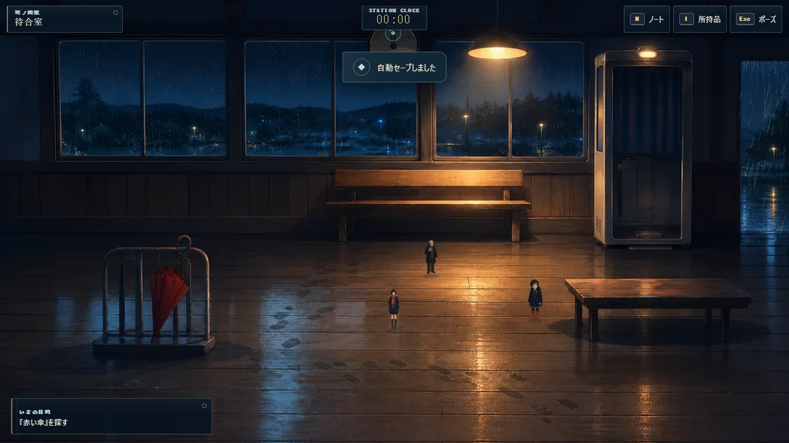
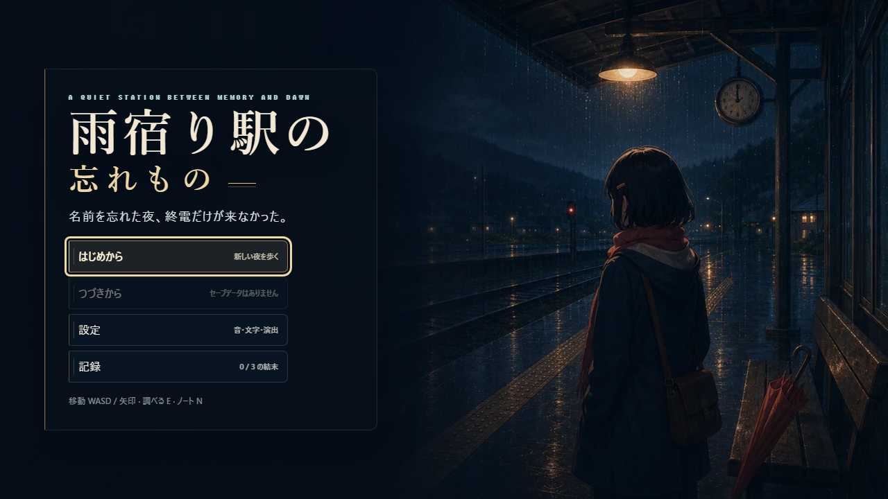
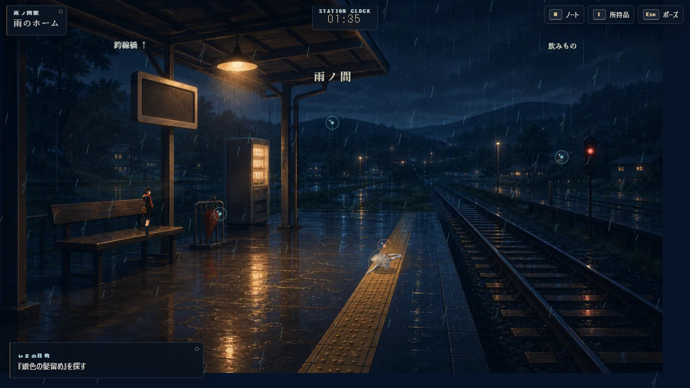
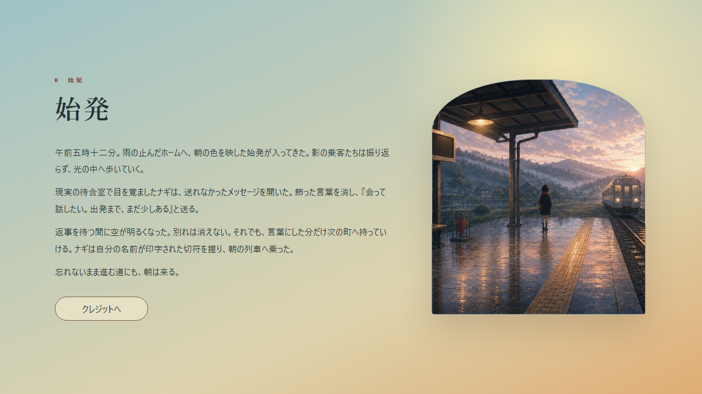

# 雨宿り駅の忘れもの

名前を忘れた主人公ナギが、終電の来ない無人駅で6つの忘れものを持ち主へ返していく、見下ろし型の2D探索アドベンチャーです。5つのエリアを歩き、手がかりをノートで照合し、よみがえる記憶をたどって3種類の結末へ進みます。Phaser 3、TypeScript、Viteで実装した、ブラウザだけで遊べる静的サイトです。

**[公開版をブラウザでプレイ](https://himiko119.github.io/rain-shelter-station/)**

> Art Quality V3はGitHub Pagesへ公開済みです。release merge commit `a55f3fa` を2026-07-15 02:52（JST）に配信しました。

> Art Integration V4はローカルrelease candidateです。Unit 94件、E2E 37件、V4専用geometry／stage検証、build／production sentinel、Chromium・390×844 touch・Edge・Firefoxのローカル本番スモークまで通過しています。公開URLは、reviewed merge、Pages配信、公開後スモークが終わるまではV3です。

## Art Integration V4

V4では、5枚の背景を論理ワールドとして正しく歩けるように、エリアごとの歩行可能ポリゴン、障害物、出口、ホットスポット接近位置、奥行き、照明、雨、水面反射、前景遮蔽をデータ化しました。

- ナギの論理位置を足元へ統一
- キーボード移動は壁・窓・家具・手すり・線路端へ侵入せず、障害物から14pxのクリアランスを維持
- ポインターの行き先を安全点へ補正し、決定論的なグリッド経路で家具を迂回
- 対象クリックは背景上の表示位置を使い、調べられる接近位置まで自動移動
- 出口は画像に合わせたポリゴンで発火し、遷移先の安全スポーンへ移動
- 既存 `saveVersion: 1` の位置がV4空間で不正な場合、進行を変えず同一エリアの安全点へ復旧



比較・目視確認用の24枚は `artifacts/art-integration-v4/after/`、5エリアの11–13秒の移動動画は `artifacts/art-integration-v4/after/video/`、contact sheetと動画フレームは `artifacts/art-integration-v4/review/` にあります。







## ゲームの特徴

- 待合室、改札広間、駅員室、跨線橋、雨のホームからなる5エリア
- 6つの忘れもの、12の手がかり、持ち主ごとの会話と記憶演出
- 間違った相手へ返してもアイテムを失わず、停滞や誤返却に応じて3段階のヒントを解放
- A「終電」、B「始発」、C「雨宿り」の3エンディングと閲覧記録
- 57点のproject-original静的画像と安全なprocedural fallbackによる、雨夜の絵本／古い地方駅アート
- 5エリア7背景、方向別Nagi animation、6人の乗客sprite、17portrait、6品、6記憶画
- 自動セーブ、音量・ミュート・文字速度・一括表示・演出軽減設定
- キーボード、マウス／ポインター、390px級のタッチ画面とUI-safeな追従cameraに対応
- エリア別の安全な歩行geometry、14px clearance、ポインター経路探索、奥行きscale／lighting／前景遮蔽

## 操作

| 操作 | キーボード | ポインター／タッチ |
| --- | --- | --- |
| 移動 | `WASD` / 矢印キー | 行き先をクリック / 方向パッド |
| 調べる・決定・会話送り | `E` / `Enter` / `Space` | 光る対象をクリック / 「調べる」ボタン |
| キャンセル・ポーズ | `Esc` | 「Ⅱ」ボタンまたは画面内の閉じるボタン |
| ノート | `N` | 「N」ボタン |
| 所持品 | `I`（`B`でも開けます） | 「持」ボタン |
| 早足 | 左右の `Shift` を押しながら移動 | 方向パッドでは通常速度 |

対象をクリックした時に距離がある場合、ナギは対象のそばまで自動で歩きます。近くでもう一度クリックすると調べます。

## 必要環境

- Node.js 20.19以上、または22.12以上（Node.js 24でも確認可能）
- npm
- Chrome / Chromium。E2E用ChromiumはPlaywrightから導入できます

```powershell
npm install
npx playwright install chromium
```

## 開発と実行

開発サーバーを起動します。

```powershell
npm run dev
```

本番ビルドを作成し、ローカルで確認します。

```powershell
npm run build
npm run preview
```

## テストと検証

```powershell
npm run lint
npm run typecheck
npm run test
npm run test:watch
npm run test:visual-geometry
npm run verify:stage-layout
npm run test:e2e
npm run build
npm run capture:art-integration
npm run verify:prod
npm run verify:live
npm run check
```

`npm run check` はlint、型検査、単体テスト、本番ビルド、本番bundleの開発用sentinel検査を順番に実行します。`npm run test:visual-geometry` はgeometryのfocused Vitestと14件のvisual-geometry E2E、`npm run verify:stage-layout` は7 viewportとdialogue containmentからなる9件のE2Eを実行します。完全なブラウザ回帰は別に `npm run test:e2e` を実行してください。Playwright系コマンドはport 4173の競合を避けるため直列実行します。

Art Integration V4で記録済みの結果は、Vitest 94件、Playwright E2E 37件、visual-geometry focused Vitest 15件＋E2E 14件、stage-layout E2E 9件の成功です。`npm run check` と4ブラウザプロファイルのローカル本番スモークも通過しました。V4 after evidenceは24枚、移動動画は5本です。Pages配信と公開URL上の再検証が残りのrelease gateです。

履歴として、`codex/art-quality-v3` はVitest 75件、Playwright E2E 13件中13件、`npm run check` に成功し、`artifacts/art-quality-v3/before/` と `after/` に各20枚の証跡を保存しています。

## ディレクトリ構成

```text
src/
  app.ts                 # Store、Phaser、DOM UI、セーブ、音の統合
  game/
    assets/              # 57画像のtyped manifest、Pages-safe URL、fallback state
    content/             # 物語contentと、5エリアのAreaArtLayout geometry
    core/                # シリアライズ可能な状態、reducer、selector、store
    input/               # キー／タッチを論理アクションへ変換
    save/                # localStorage adapter、検証、version移行、V4安全位置復旧
    systems/             # Web Audioによる環境音と効果音
    debug/               # 開発パネルとnamed E2E scenario bridge
  phaser/
    scenes/              # 探索を担当する単一のExplorationScene
    view/                # 背景／sprite、奥行き、lighting、雨、前景遮蔽、geometry debug overlay
  ui/                    # 会話、ノート、所持品、設定、記録、タッチUI
  styles/                # テーマとレスポンシブCSS
tests/
  unit/                  # 状態遷移、入力、コンテンツ、セーブのVitest
  e2e/                   # 通常ルート、セーブ、設定、結末、モバイルのPlaywright
scripts/                 # 本番bundle検査
docs/                    # 企画、設計、実装計画、テスト計画、プレイテスト記録
artifacts/playtest/      # 目視確認用スクリーンショット
artifacts/art-quality-v3/ # mood board、UI案、before / after、Design QA比較
artifacts/art-integration-v4/ # spatial integrationのbefore / after、24枚、5動画、review sheets
public/assets/art-v3/     # 出荷するproject-original画像57点
```

## セーブデータ

進行、位置、所持品、手がかり、記憶、結末記録、設定は `localStorage` の `rain-shelter-station.save.v1` に自動保存します。データは `saveVersion: 1` のschemaで読み書きし、既知のversion 0は移行後に現行validatorへ通します。JSON破損、未知ID、範囲外の値、整合しない進行、将来versionは採用せず、安全な初期状態へフォールバックします。

タイトルまたはポーズ画面の設定から「セーブデータを削除」を選び、確認画面で削除できます。削除するとこのキーが消去され、現在の進行は初期状態へ戻ります。

Art Integration V4でもsave schemaを変更しておらず、引き続き `saveVersion: 1` です。旧v1セーブのプレイヤー位置だけが新しい歩行可能領域から外れる場合は、ロード時に14px clearanceを満たす同一エリア内の最寄り安全点へ補正します。位置以外の進行データと向きは保持します。

## 素材と利用条件

背景、人物、6つの忘れもの、記憶、タイトル、エンディングは本作向けに生成・編集したproject-original画像です。Phaser GraphicsとDOM/CSSの旧表現は画像欠損時のfallbackとして残しています。音は外部音源を使わずWeb Audioで生成します。`public/favicon.svg`もproject内制作です。依存パッケージには各パッケージ固有のライセンスが適用されます。

このリポジトリにはコードの利用許諾を定める `LICENSE` がなく、`package.json` にもlicenseフィールドはありません。そのため、プロジェクトのコードをMITライセンスとして扱うことはできません。再利用・改変・再配布を行う場合は、権利者から別途許諾を得てください。

## 既知の制約

- Web Audioはブラウザの自動再生制限に従い、最初のクリックまたはキー操作の後に開始します。音声デバイスが使えない場合もゲーム進行は継続します。
- V4 buildはHTML 0.68 kB（gzip 0.46 kB）、JavaScript 1,426.81 kB（gzip 386.84 kB）、CSS 80.43 kB（gzip 17.85 kB）です。Phaserを含むJavaScriptだけがViteの500 kB chunk警告対象になりますが、ビルド失敗ではありません。
- Chromium 149、Windows Microsoft Edge 150、Firefox 151はローカルproduction buildでスモーク済みです。WebKitはChromiumと同じ深さでは未確認です。
- 公開URLの検証記録は現時点ではArt Quality V3のものです。Art Integration V4はPages deploymentとproduction smokeの完了後に公開版として扱います。

公開前後の確認手順と現在の状態は [docs/DEPLOYMENT.md](docs/DEPLOYMENT.md)、画面・E2Eの記録は [docs/PLAYTEST_REPORT.md](docs/PLAYTEST_REPORT.md) を参照してください。
