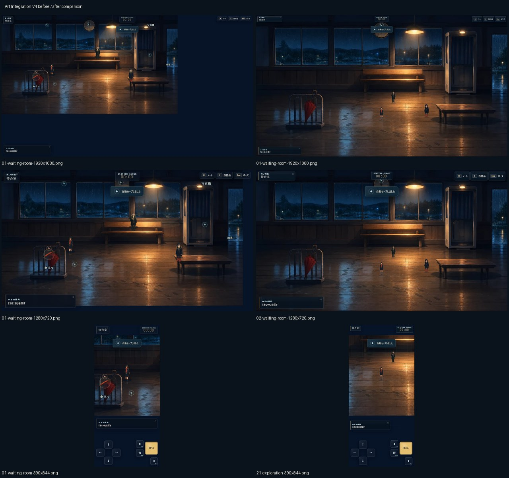
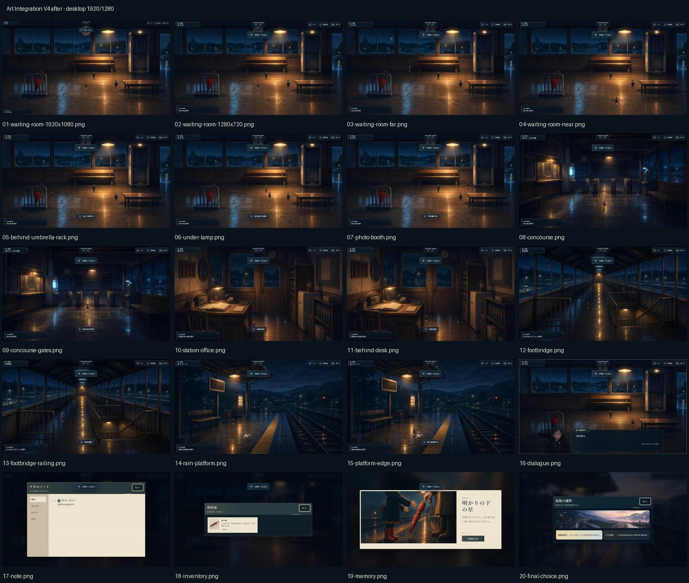
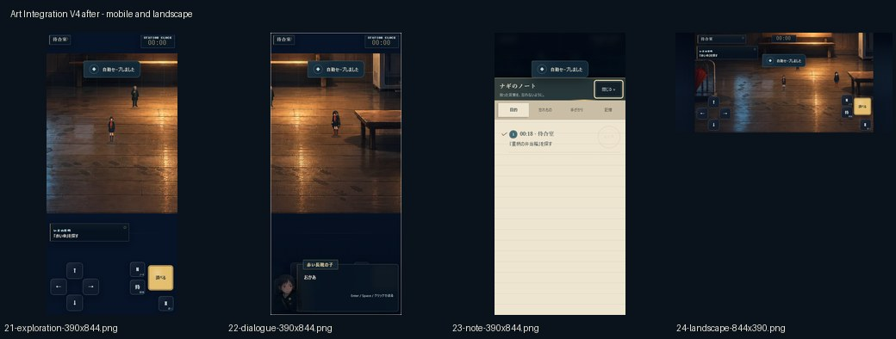
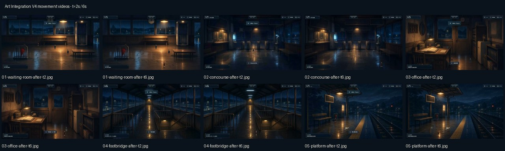

# Design QA — Art Integration V4

## Audit scope

Art Integration V4 is evaluated as a playable 2.5D stage: stage occupancy, authored movement geometry, actor grounding and perspective, foreground/background ordering, environment effects, contextual markers, DOM/Canvas integration, motion evidence, mobile composition, and the memory presentation.

This score is based on the committed V4 captures and review sheets, sampled frames from all five movement videos, the full regression suite, and production verification in Chromium, mobile Chromium, Edge, and Firefox. GitHub Pages deployment and public-site verification are complete.

### Primary evidence

- Full-HD comparison: `artifacts/art-integration-v4/before/desktop-1920/01-waiting-room-1920x1080.png` and `artifacts/art-integration-v4/after/desktop-1920/01-waiting-room-1920x1080.png`
- Desktop states: `artifacts/art-integration-v4/after/desktop-1280/02-waiting-room-1280x720.png` through `20-final-choice.png`
- Mobile states: `artifacts/art-integration-v4/after/mobile-390/21-exploration-390x844.png` through `24-landscape-844x390.png`
- Movement routes: `artifacts/art-integration-v4/after/video/01-waiting-room-after.webm` through `05-platform-after.webm`
- Sampled movement frames: `artifacts/art-integration-v4/review/video-frames/`

## Why the V3 result was insufficient

The previous `passed` result evaluated asset finish, mockup similarity, 1280×720 composition, mobile overflow, and progression stability. That evaluation was too narrow for a fixed-perspective exploration game. It did not make Full-HD stage occupancy, foot-point containment, furniture collision, perspective scaling, occlusion, effect-mask registration, or same-route movement video into release gates.

V3 therefore passed polished illustrations while missing two P0 spatial failures: the Full-HD world was clamped to the upper-left, and the player could enter walls, windows, and furniture. This was an evaluation-model failure, not an individual-review failure. V4 replaces the prior mockup-centric conclusion with spatial, motion, and multi-viewport evidence.

## V4 scorecard

Scores use a 1–10 scale. The 15 requested criteria total 131 points, for an average of **8.73 / 10** (equivalent to 4.37 / 5). Every category is 8 or higher.

| Criterion | Score | Evidence and assessment |
| --- | ---: | --- |
| Stage occupancy | 10 | The after capture fills the 1920×1080 stage; the large right/bottom void visible in the before capture is gone. See the Full-HD pair and `review/before-after-contact-sheet.jpg`. |
| Stage centering | 10 | Desktop fills the 16:9 viewport and 844×390 uses symmetric side margins. Canvas, HUD, objective, and touch layers share one visible stage boundary. See `after/desktop-1920/01-waiting-room-1920x1080.png` and `after/mobile-390/24-landscape-844x390.png`. |
| Background / walkable-range alignment | 9 | Five area layouts now define walkable polygons, obstacle polygons, exits, and hotspot approach points. Area screenshots and sampled route frames keep actors on illustrated floor surfaces. Current geometry/reachability tests encode the boundary rules. |
| Actor grounding | 8 | Bottom-center feet and attached contact shadows read as floor contact across the waiting room, office, footbridge, and platform. The remaining difference in painterly density between small sprites and backgrounds prevents a higher score. |
| Actor / furniture scale | 8 | NPCs are moved off bench surfaces and character scale follows the room depth. Far actors are intentionally small, but the scale transition remains more legible in motion than in isolated captures. See waiting-room near/far and office screenshots. |
| Perspective scale | 9 | Per-area far/near scale profiles are present in `src/game/content/areaArtLayouts.ts`; the t=2s/t=6s movement samples show size change along the authored depth axis without a fixed-scale cut. |
| Foreground / background ordering | 8 | Foreground definitions exist for the umbrella rack, benches, booth, gates, desk, shelves, bridge rails, platform columns, and related architecture. The desk and railing evidence reads correctly, although some occlusion states are subtle in a single frame. |
| Character lighting | 8 | Actors receive zone-dependent tone, shadow, rim, and reflection treatment rather than a single global tint. Lamp and cool-window transitions are visible but deliberately restrained at gameplay scale. |
| Light-source / background alignment | 9 | Authored zones correspond to illustrated lamps, windows, machines, and platform lighting. No isolated legacy ellipse is visible in the desktop or motion contact sheets. |
| Rain mask | 9 | Indoor rain is confined to windows/door openings and outdoor rain to the platform/bridge regions; stage-specific effect definitions replace procedural coordinates. See the five-area desktop sheet and current marker/effect test definitions. |
| Naturalness of investigation display | 9 | Persistent debug-like labels and marker crowds are absent. Normal captures show no markers at distance; near captures reveal one nearest target plus a DOM prompt. See `03-waiting-room-far.png`, `05-behind-umbrella-rack.png`, and `15-platform-edge.png`. |
| UI / stage integration | 9 | HUD, objective, dialogue, notebook, inventory, memory, and touch controls remain inside `.game-stage`. Dialogue preserves the scene and the station-paper/metal material language replaces generic cards. See `16-dialogue.png` through `19-memory.png`. |
| Appearance during movement | 8 | Five 11–13 second route artifacts and their sampled frames cover all areas. The samples show continuous depth placement, attached shadows, restrained markers, and stable camera framing. Full temporal smoothness still depends on replaying the WebM files on target hardware. |
| Mobile operability | 8 | 390×844 separates world, objective, dialogue, notebook, and touch controls without horizontal overflow; 844×390 preserves 44px-class controls and symmetrical framing. Touch movement, menus, outside-stage rejection, 44px targets, and save/reload passed in the final local E2E and production-smoke runs. |
| Memory composition | 9 | The memory image is now the dominant foreground, with a real-image blurred backdrop, paper narrative surface, integrated progress, and action. See `after/desktop-1280/19-memory.png`; the backdrop is intentionally quiet rather than decorative. |

## P0 / P1 status

| Severity | Original issue | V4 status | Evidence |
| --- | --- | --- | --- |
| P0 | Full-HD stage left large one-sided empty space | Resolved in available V4 evidence | Full-HD before/after pair and stage-layout implementation/tests |
| P0 | Player could enter windows, walls, benches, booth, and non-floor space | Resolved in current geometry model and committed route evidence | `src/game/content/areaArtLayouts.ts`, `tests/e2e/movement-and-reachability.spec.ts`, five movement routes |
| P1 | Actors looked pasted onto the illustration | Resolved to the V4 acceptance level | perspective profiles, contact shadows, light zones, waiting/office/bridge/platform captures |
| P1 | Legacy lights, rain, and ripples did not match static art | Resolved in authored static-art paths | per-area effect definitions, `tests/e2e/markers-and-effects.spec.ts`, desktop/video sheets |
| P1 | Persistent marker and floating-label clutter | Resolved | far/near screenshots and marker-restraint test definitions |

**Open P0: 0. Open P1: 0** within the audited V4 implementation and committed evidence.

## Non-blocking observations

- P2: the small character sprites remain visually crisper and less painterly than the background at some far-depth positions. Their grounding and scale are coherent, but a future higher-resolution character pass could improve material cohesion.
- P3: the one-item inventory state leaves a deliberate empty record area. It is readable and thematic, though a denser luggage-tag arrangement could use the space more expressively as inventory grows.
- P3: the autosave toast overlaps the top-center clock or modal header in several deterministic captures. It is transient and does not cover a primary action, but capture timing could suppress it for cleaner review evidence.

## Evidence limits and release gates

- Screenshots and automated checks do not establish full WCAG conformance; a specialist screen-reader audit remains outside this release scope.
- The final local record includes 94 Vitest tests, 37 full Playwright E2E tests, 15 focused geometry Vitest tests, 14 visual-geometry E2E tests, and 9 stage-layout E2E tests.
- Build, production sentinel, and local production smoke passed in Chromium desktop, Chromium touch, Edge, and Firefox with zero browser/network errors.
- GitHub Pages build/deploy completed for merge `27b3874`; the public JS/CSS matched the release build and the four-profile smoke passed with zero errors.

## Result

**Design/spatial QA: passed — 8.73 / 10, no open P0 or P1 in the available evidence.**

**Release certification: passed.** V4 is published, production-verified, and has no open P0 or P1 finding.
